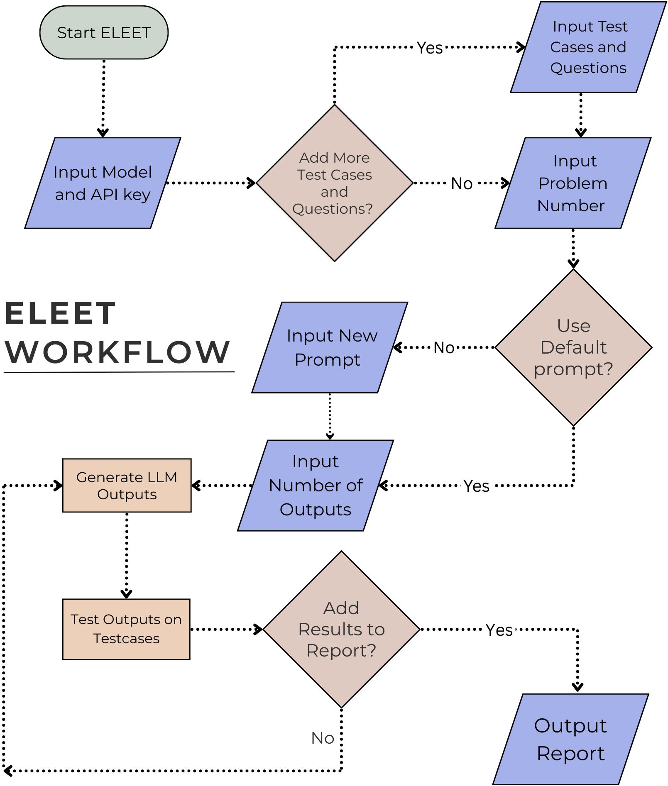

# ELEET: Evaluating LLMs on Coding Questions

**ELEET** is an automated system for testing how well large language models (LLMs) solve LeetCode-style coding problems. It handles prompt creation, model querying, code extraction, test execution, and result logging—all with minimal manual effort.



## 🔧 Files

- `Final_TestScript.py` – Main script for running evaluations
- `test_problems_video.csv` – Backend database of questions + test cases
- `Final_Report.csv` – Output report for model results (initially empty)

## ⚙️ How It Works

1. **Add Questions** to the CSV using the format: description, constraints, function signature, test cases  
2. **Configure Model/API** – Select model type and enter key (if needed)  
3. **Choose Question** – Pick from the list or let the system choose randomly  
4. **Define Prompt** – Use default or enter a custom prompt  
5. **Set # of Responses** – Specify how many outputs to generate  
6. **Query Model** – Responses are fetched via API  
7. **Run Tests** – Code is parsed and tested on predefined cases  
8. **Export Results** – Save outputs to `Final_Report.csv`

## ✅ Output Includes

- Prompt used  
- Model name  
- Code generated  
- Whether all test cases passed  

## 🏁 Run It

```bash
python Final_TestScript.py
